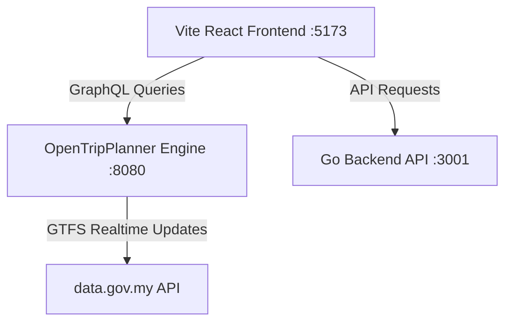

# LaluanKU 🗺️
> **Moovit Alternative for Malaysia (KL/Selangor)**

LaluanKU is an open-source, local-first multimodal transit router designed specifically for the Klang Valley (Kuala Lumpur & Selangor) in Malaysia. It provides real-time route planning, dynamic transit fare calculations, and interactive map displays using OpenStreetMap (OSM) and official public transportation GTFS schedules (MRT, LRT, KTM, RapidKL bus feeds).

---

## ✨ Features

- 📍 **Smart Autocomplete & Location Scan**: Real-time address geocoding restricted to the Klang Valley via OpenStreetMap Nominatim, plus one-click GPS geolocation reverse-geocoding.
- ⚡ **Side-by-Side Multimodal Routing**: Queries OpenTripPlanner in parallel to fetch and show travel times for 5 transport modes side-by-side in one search:
  * 🚇 **Transit**: Pedestrian walking combined with LRT/MRT, KTM, and RapidKL buses.
  * 🚗 **Drive**: Direct driving route.
  * 🚶‍♂️ **Walk**: Pedestrian routing.
  * 🚴‍♂️ **Cycle**: Bicycle routing.
  * 🚗🚇 **Mixed (Park & Ride)**: Commuter routing that combines driving to a transit station park-and-ride lot, parking, and taking transit to the destination.
- 💰 **Custom Malaysia Fare Calculator**: Estimates public transit fares dynamically based on transit mode and travel leg distance (flat rates for trunk/feeder buses, distance-tiered fares for LRT/MRT and KTM).
- 🗺️ **Premium Dark Leaflet Map**: Custom dark-themed Leaflet map overlay highlighting walk paths (dotted grey) and transit lines (color-coded by mode).
- 🚉 **Transfer Stop Indicators**: Highlights transfer stations along active public transit routes.
- 🚀 **Live Ride simulation**: Employs an active vehicle tracker simulation along the route lines with custom mode-based emojis (`🚗`, `🚶‍♂️`, `🚴‍♂️`, `🚇`, `🚆`, `🚌`).

---

## 🛠️ Architecture

LaluanKU is built as a microservices architecture running inside Docker:



1. **Frontend (React + Vite + Leaflet + Tailwind CSS v4)**: A responsive dark-themed dashboard mapping routes and listing itineraries.
2. **Routing Engine (OpenTripPlanner v2.6.0)**: Shaded Java routing engine loaded with Klang Valley street networks and schedules.
3. **Backend API (Go + Gin)**: Lightweight Go gateway API.

---

## 🚀 How to Run Locally

### Prerequisites

Ensure you have the following installed on your machine:
- [Docker](https://www.docker.com/) (includes Docker Compose)

---

### Step-by-Step Setup

1. **Clone the repository**:
   ```bash
   git clone https://github.com/TeddyHuZz/laluanKU.git
   cd laluanKU
   ```

2. **Start the containers**:
   Run the following command in the root directory:
   ```bash
   docker compose up --build -d
   ```
   *This command compiles the Go backend and React frontend, loads the pre-built routing graph inside the OpenTripPlanner container, and spins up all three services in the background.*

3. **Verify running containers**:
   ```bash
   docker compose ps
   ```
   All three services (`laluanku-frontend-1`, `laluanku-backend-1`, `laluanku-otp-engine-1`) should show a status of **Up**.

---

### Service Ports

Once started, the services can be accessed at:

- **Frontend App**: [http://localhost:5173](http://localhost:5173) (Open this in your browser to plan routes!)
- **OpenTripPlanner Engine**: [http://localhost:8080](http://localhost:8080) (GraphQL API endpoint at `/otp/routers/default/index/graphql`)
- **Go API Backend**: [http://localhost:3001/health](http://localhost:3001/health) (Responds with status `"ok"`)

---

## 📦 How to Rebuild/Update Graph Data (Advanced)

The repository comes with a pre-built `graph.obj` covering Kuala Lumpur, Selangor, and Negeri Sembilan. If you wish to update the map layout (`osm.pbf`) or static transit schedules (`gtfs.zip` files under `otp-engine/graphs/malaysia/`), you must rebuild the routing graph:

1. Place your updated `.osm.pbf` and `.gtfs.zip` files into the `otp-engine/graphs/malaysia/` directory.
2. Run the graph build tool inside the container:
   ```bash
   docker compose run --entrypoint "java -Xmx4G -jar otp-2.6.0-shaded.jar --build graphs/malaysia" otp-engine
   ```
3. Once the build completes and creates a new `graphs/malaysia/graph.obj` file, restart the environment:
   ```bash
   docker compose restart otp-engine
   ```

---

## 📝 License

This project is open-source and available under the MIT License.
